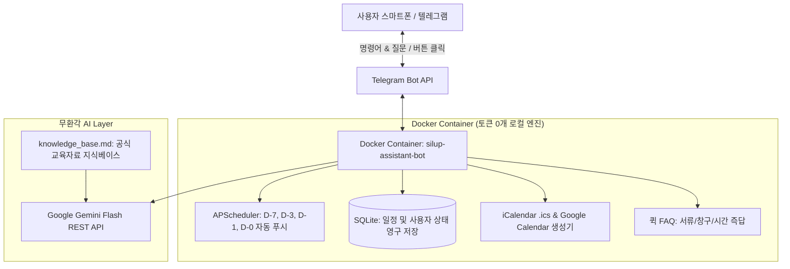

# 🤖 고용노동부 실업급여 전문 전담 비서봇 (Silup Assistant Bot)

> **"실업인정일, 구직활동 숙제, 증빙 서류를 단 하루도 놓치지 않는 가장 똑똑한 1:1 전담 비서"**  
> 고용노동부 공식 실업인정 집체교육 자료 및 취업드림수첩 지침을 전수 분석하여 이식한 **텔레그램 기반 스마트 실업급여 관리 봇**입니다.

---

## ✨ 주요 기능 (Key Features)

### 1. 📅 전 회차 인정일 & 구직활동 기간 자동 계산 (수학적 룰 엔진)
- 본인의 **1차 실업인정일**, **수급자 유형(일반/반복/장기/만60세이상)**, **소정급여일수(120~270일)**만 입력하면 수급 만료일까지의 **모든 회차 인정일과 활동 기간, 필수 요구 건수**를 1초 만에 자동 계산합니다.
- 주말/공휴일 자동 보정 및 4차/8차 등 센터 의무 출석 회차를 자동으로 분류합니다.

### 2. ⏰ 4단계 지능형 푸시 리마인더 (APScheduler)
인정일을 까먹지 않도록 봇이 먼저 스마트폰 알림/진동으로 말을 겁니다. (한국 표준시 기준 매일 09:00 / 14:00 점검)
- **D-7 (1주일 전)**: 이번 차수 구직활동 기간 시작 안내 및 추천 활동(온라인 특강 잔여 횟수, 워크넷 등) 가이드
- **D-3 (3일 전)**: 구직활동 완료 여부 점검 및 증빙서류(취업활동증명서 + 채용공고문) 캡처 준비 체크리스트
- **D-1 (전날)**: 내일 전송 예고 (자정 00:00 ~ 17:00 전송, 오전 전송 권고 / 4차·8차 방문일 안내)
- **D-0 (당일 아침 09:00)**: 실업인정 인터넷 신청 바로가기 링크 및 마감(17:00) 전 최종 제출 독려

### 3. 📆 구글 캘린더 & 스마트폰 캘린더 원클릭 연동
- **iCalendar (`.ics`) 파일 지원**: 아이폰, 갤럭시, 구글 캘린더에 전체 11회차 일정과 당일 알람을 한 번에 일괄 등록!
- **구글 캘린더 원클릭 추가 웹 링크**: 브라우저에서 버튼 터치 한 번으로 구글 캘린더 일정으로 바로 저장.

### 4. 🧠 할루시네이션 0% & 초경량 Q&A (Google Gemini Flash RAG)
- 인터넷의 불확실한 소문이 아닌, **실제 고용센터 집체교육 음성 전사본과 취업드림수첩 공식 안내문**만을 바탕으로 답변합니다.
- *온라인 취업특강 전체 2회 제한, 1차 실업인정 동영상 재수강 불가, 하루 1건 인정 원칙, 민간 취업포털 제출 서류 2종 등* 까다로운 규정을 명확하고 안전하게 안내합니다.
- 자주 묻는 질문(FAQ)은 AI 토큰 소모 0개로 즉시 응답하며, 세부 질문 시에도 Gemini Flash 무료 티어로 평생 비용 없이 운영됩니다.

---

## 🏗️ 시스템 아키텍처



---

## 🚀 빠른 시작 가이드 (Quick Start)

### 1. 사전 준비 (API 키 준비)
- **Telegram Bot Token**: 텔레그램에서 [@BotFather](https://t.me/BotFather)에게 `/newbot` 입력 후 토큰 발급 (무료, 1분 소요)
- **Google Gemini API Key**: [Google AI Studio](https://aistudio.google.com)에서 무료 API 키 생성 (일일 1,500회 무료)

### 2. 레포지토리 복제 및 설정
```bash
# 레포지토리 클론
git clone https://github.com/tomasjoa21/silup_chatbot.git
cd silup_chatbot

# 환경변수 파일 설정
cp .env.example .env
nano .env  # 본인의 TELEGRAM_BOT_TOKEN 및 GEMINI_API_KEY 입력
```

### 3. Docker로 실행
```bash
docker compose up -d
```
> 컨테이너가 백그라운드에서 상시 구동되며, 재부팅 시에도 `restart: unless-stopped` 옵션으로 자동 복구됩니다.

---

## 📱 텔레그램 봇 명령어 및 사용법

| 명령어 | 설명 |
| :--- | :--- |
| `/start` | 봇 시작 및 기본 프로필/메뉴 확인 |
| `/setup` | 수급 정보 재설정 (1차 인정일, 수급 유형, 소정일수 입력) |
| `/status` | 내 전체 실업인정 일정표 및 다가오는 회차(D-day) 조회 |
| `/calendar` | 스마트폰 캘린더 등록용 `.ics` 파일 다운로드 및 구글 캘린더 추가 링크 |
| `/faq` | 자주 묻는 질문 퀵 메뉴 (증빙서류 제출법, 인정일 착오 변경, 창구 위치 등) |

---

## 🔒 보안 및 개인정보 보호 (Privacy & Security)
- 본 레포지토리는 고용노동부 공식 공통 규정만을 담고 있으며, 사용자의 개인정보(주민번호, 실명, 주소 등)는 포함되지 않습니다.
- 사용자의 등록 데이터는 로컬 Docker 볼륨(`data/silup.db`)에만 저장되며 외부 서버로 전송되지 않습니다.
- `.env` 및 개인 데이터베이스 파일은 `.gitignore`에 의해 안전하게 보호됩니다.

---

## 📄 라이선스
MIT License
